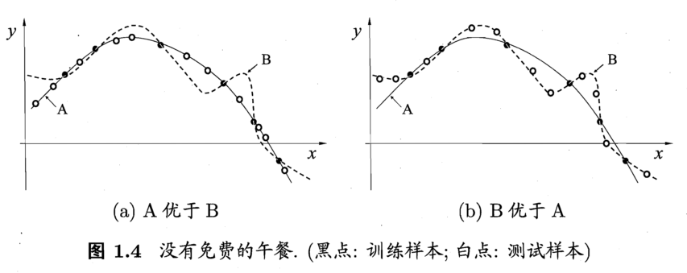

本文总结了深度学习面试中常见的问题。

<!--more-->

## CNN最成功的应用是在CV，那为什么NLP和Speech的很多问题也可以用CNN解出来？

<https://zhuanlan.zhihu.com/p/25005808>
  
## 什么样的资料集不适合用深度学习

- 数据集太小。因为神经网络有大量的参数需要训练
- 数据集没有局部相关性。目前深度学习应用的领域图像、语音和自然语言处理，其共性为
  局部相关性。例如，图像中的像素组成物体，语音中音位组成单词，文本中的单词组成句
  子。而深度学习过程就是学习局部低层次的特征，然后组合成高层次的特征，得到不同特
  征之间的空间相关性。

## 对所有优化问题来说, 有没有可能找到比现在已知算法更好的算法？

- 不存在一个通用的模型，对所有的优化问题都能做到性能最佳

{#fig:noFreeLunch}

- 一个学习算法 A，若它在某些问题上比学习算法 B 更好，则必然存在一些问题，在那里
  B 比 A 好。也就是说，无论算法 A 多聪明，算法 B 多笨拙，它们的期望性能相等
- 没有免费的午餐定理假设所有问题出现的概率相等。实际应用中，不同的场景，会有不同
  的问题分布。所以算法优化的核心是具体问题具体分析

## 用贝叶斯机率说明 Dropout 的原理

请参考[文献阅读：Dropout as a Bayesian Approximation: Insights and
Applications](./2018-05-29-Dropout-as-a-Bayesian-Approximation-Insights-and-Applications.html)
。

## 何为共线性，跟过拟合有啥关联？

- 共线性指多变量线性回归中，变量之间由于存在高度相关关系而使回归估计不准确。
- 共线性会造成冗余，导致过拟合
- 解决方法：排除变量的相关性/正则化

## 说明如何用支持向量机实现深度学习

## 列举常见的范数及其应用场景，如 

## 参考文献
