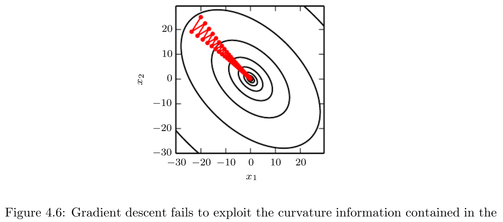

本文记录了《Deep Learning》[@goodfellow2016deep]的读后感。

<!--more-->

## 介绍

许多人工智能任务依赖于正确的特征集，即表示。但很多情况下，人们不知道该选取哪些特
征。所以需要使用机器学习发现表示（特征集）。

自编码器组合编码函数，在保留尽可能多的信息的同时让新表示满足一些特性。

## Linear Algebra

### 范数

范数
: 满足以下性质的任意函数 $f$

  - $f(\bm{x}) = 0 \Rightarrow \bm{x} = \bm{0}$
  - $f(\bm{x} + \bm{y}) \le f(\bm{x}) + f(\bm{y})$ （三角不等式）
  - $\forall \alpha \in \mathbb{R}, f(\alpha\bm{x}) = |\alpha|f(\bm{x})$

$L^p$ 范数：
$$||\bm{x}||_p = \left(\sum_i |x_i|^p\right)^{\frac{1}{p}}$$ {#eq:Lp}
其中 $p \in \mathbb{R}, p \ge 1$。

$L^2$ 范数为 Euclidean 距离。

- $L^2$ 范数平方的优点
    - 计算简单
        - 偏微分只取决于 $x_i$，与其他 $x_j$ 没有关系
- $L^2$ 范数平方的缺点
    - 在原点附近变化缓慢

- $L^1$ 范数的优点
    - 在原点附近变化较快，可以区分 $0$ 和接近于 $0$ 的值

“$L^0$” 范数表示向量里非零元素的个数。（叫法不正确）

$L^\infty$ 范数或者最大范数：
$$||\bm{x}||_\infty = \max_i|x_i|$$ {#eq:LInfty}

Frobenius 范数为：
$$||\bm{A}|| = \sqrt{\sum_{i, j}A_{i, j}^2}$$ {#eq:frobeniusNorm}

点积可以用范数表示：
$$\bm{x}^T\bm{y} = ||\bm{x}||_2 ||\bm{y}||_2 \cos\theta$$ {#eq:dotProduct}

## Probability and Information Theory

### Bayes' Rule

$$P(\textrm{x}|\textrm{y}) = \frac{P(\textrm{x})P(\textrm{y}|\textrm{x})}{P(\textrm{y})}$$ {#eq:bayesRule}

### 常见概率分布

#### Gaussian Distribution

$$\mathcal{N}(x;\mu, \sigma^2) = \sqrt{\frac{1}{2\pi\sigma^2}}\exp\left(-\frac{1}{2\sigma^2}(x-\mu)^2\right)$$ {#eq:gaussianDistribution}
为了计算的简便，也可以用 $\beta^{-1} = \sigma^2$ 替代 $\sigma^2$ 作为参数，其中
$\beta \in (0, \infty)$，表示精度。

Gaussian 分布应用广泛的原因：

- 中心极限定理表明许多独立随机变量的和接近于正态分布；
- 同方差的所有分布里，正态分布的不确定性最大，意味着向模型插入了最少的先验知识。

$$\mathcal{N}(\bm{x};\bm{\mu},\bm{\Sigma}) = \sqrt{\frac{1}{(2\pi)^n\det(\bm{\Sigma})}}\exp\left(-\frac{1}{2}(\bm{x}-\bm{\mu})^\mathsf{T}\bm{\Sigma}^{-1}(\bm{x}-\bm{\mu})\right)$$ {#eq:gaussianDistributionMulti}

#### 指数和 Laplace 分布

Laplace 分布
: $$\textrm{Laplace}(x;\mu,\gamma) = \frac{1}{2\gamma}\exp\left(-\frac{|x-\mu|}{\gamma}\right)$$ {#eq:laplaceDistribution}

### 混合分布

$$P(\bm{\textrm{x}}) = \sum_{i}P(\textrm{c}=i)P(\bm{\textrm{x}} \mid \textrm{c}=i)$$ {#eq:distributionMixture}

Gaussian 混合
: $P(\bm{\textrm{x}} \mid \textrm{c}=i)$ 为 Gaussian 分布。

万能近似器
: Gaussian 混合。

### 常见函数

logistic sigmoid:
$$\sigma(x) = \frac{1}{1 + \exp(-x)}$$ {#eq:sigmoid}
因为取值范围是 $(0, 1)$，所以用来产生 Bernoulli 分布的 $\phi$ 参数。

softplus:
$$\zeta(x) = \log(1 + \exp(x))$$ {#eq:softplus}
因为取值范围是 $(0, \infty)$，所以用来产生正态分布的 $\beta$ 或 $\sigma$ 参数。
之所以叫 softplus 是因为它是
$$x^+ = \max(0, x)$$ {#eq:plus}
的光滑版。

Rectified Linear Unit(ReLU):
$$g(z) = \max(0, z)$$ {#eq:relu}
只要激活，梯度即为 $1$，相比于 sigmoid 更加容易学习。

tanh:
$$\tanh(x) = \frac{e^x - e^{-x}}{e^x + e^{-x}}$$ {#eq:tanh}
$\tanh(0) = 0$，更类似于单位函数。

Radial basis function (RBF):
$$h_i = \exp\left(-\frac{1}{\sigma_i^2}\left\lVert\bm{W}_{:,i} - \bm{x}\right\rVert^2\right)$$ {#eq:rbf}
当 $\bm{x}$ 接近模板 $\bm{W}_{:,i}$ 时，函数激活；此外大部分情况不激活，所以难于
优化。

### 信息论

Kullback-Leibler (KL) 散度：
$$D_{\textrm{KL}}(P||Q) = \mathbb{E}_{\textrm{x} \sim P}\left[\log\frac{P(x)}{Q(x)}\right] = \mathbb{E}_{\textrm{x} \sim P}[\log P(x)-\log Q(x)]$$ {#eq:klDivergence}
描述了概率分布 $P(\textrm{x})$ 和 $Q(\textrm{x})$ 的区别有多大。KL 散度非负，当
且仅当 $P(\textrm{x})$ 和 $Q(\textrm{x})$ 处处相等[^klEqualEverywhere]时
$D_{\textrm{KL}}(P||Q) = 0$。但 KL 散度不对称：对于某些 $P$ 和 $Q$，
$D_{\textrm{KL}}(P||Q) \neq D_{\textrm{KL}}(Q||P)$。

交叉信息熵：
$$H(P, Q) = -\mathbb{E}_{\textrm{x} \sim P} \log Q(x)$$ {#eq:crossEntropy}
KL 散度和交叉信息熵之间的关系：$H(P, Q) = H(P) + D_{\textrm{KL}}(P||Q)$。

[^klEqualEverywhere]: 当 $\textrm{x}$ 为离散随机变量时，需要处处相等；当
    $\textrm{x}$ 为连续随机变量时，需要几乎处处相等。

## 数值计算

### 上溢和下溢

下溢
: 接近于 $0$ 的数取整为 $0$。

下溢
: 大数近似成 $\infty$ 或者 $-\infty$。

为了使数值计算稳定，需要把 softmax 里的 $x$ 换成 $x - \max_i x_i$。

### 病态条件

矩阵条件数

: $\kappa(\bm{A}) = \lVert \bm{A}^{-1}\rVert \cdot \lVert\bm{A}\rVert$。当范数选
  $L^2$ 范数，且 $\bm{A}$ 为正规矩阵时，$\kappa(\bm{A}) =
  \left\lvert\frac{\lambda_{max}(\bm{A})}{\lambda_{min}(\bm{A})}\right\rvert$。
  其中，$\lambda_{max}(\bm{A})$ 和 $\lambda_{min}(\bm{A})$ 分别为 $\bm{A}$ 的极
  大和极小（根据模数）特征值。当条件数较大时，矩阵求逆对输入错误非常敏感，此时称
  矩阵为病态条件的矩阵。

### 梯度之外：Jacobian 和 Hessian 矩阵

Jacobian 矩阵
: 对一个函数 $\bm{f}:\mathbb{R}^m \to \mathbb{R}^n$ 来说，
  $$\bm{J}_{i, j} = \frac{\partial}{\partial x_j} f(\bm{x})_i$$ {#eq:jacobianMatrix}
  为其 Jacobian 矩阵，$\bm{J} \in \mathbb{R}^{n\times m}$。

Hessian 矩阵
: 对一个函数 $f: \mathbb{R}^n \to \mathbb{R}$ 来说，
  $$\bm{H}(f)(\bm{x})_{i, j} = \frac{\partial^2}{\partial x_i\partial x_j}f(\bm{x})$$ {#eq:hessianMatrix}
  为其 Hessian 矩阵。

Hessian 矩阵的条件数描述了二阶导数有多大区别。

{#fig:hessianMatrixConditionNumber}

### 有约束的优化

扩展 Lagrange 函数
: $$L(\bm{x}, \bm{\lambda}, \bm{\alpha}) = f(\bm{x}) + \sum_i \lambda_i g^{(i)}(\bm{x}) + \sum_j \alpha_j h^{(j)}(\bm{x})$$ {#eq:generalizedLagrange}

有约束的最小化
: $$\min_{\bm{x}}\max_{\bm{\lambda}}\max_{\bm{\alpha}, \bm{\alpha} \le 0}L(\bm{x}, \bm{\lambda}, \bm{\alpha})$$ {#eq:constrainedMin}

KKT 条件（有约束优化的最优点的必要条件）
: - 扩展 Lagrange 函数的梯度为 $0$；
 - 满足 $\bm{x}$ 和 KKT 乘子（$\bm{\lambda}, \bm{\alpha}$）的约束；
 - $\bm{\alpha} \odot \bm{h}(\bm{x}) = \bm{0}$。

活跃约束
: $h^{(i)}(\bm{x}^*) = 0$ 时称 $h^{(i)}(\bm{x})$ 为活跃的约束。

## Machine Learning Basics

### 学习算法

#### 例子：线性回归

均方误差
: $$\textrm{MSE}_{\textrm{test}} = \frac{1}{m}\sum_i (\hat{\bm{y}}^{(\textrm{test})} - \bm{y}^{(\textrm{test})})_i^2$$ {#eq:mse}

### 容量、过拟合和欠拟合

模型容量
: （非正式）拟合各类函数的能力。

表示容量
: 学习算法可以选择的函数家族。

有效容量
: 实际容量，小于表示容量。

最优容量
: 泛化误差最小时的模型容量。

### Maximum Likelihood Estimation（最大似然估计）

$$
\begin{align*}
\bm{\theta}_{\textrm{ML}} &= \arg\max_{\bm{\theta}}p_{\textrm{model}}(\mathbb{X;\bm{\theta}}) \\
&= \arg\max_{\bm{\theta}}\prod_{i=1}^m p_{\textrm{model}}(\bm{x}^{(i)};\bm{\theta}) \\
&= \arg\max_{\bm{\theta}}\sum_{i=1}^m \log p_{\textrm{model}}(\bm{x}^{(i)};\bm{\theta}) \\
&= \arg\max_{\bm{\theta}}\mathbb{E}_{\textrm{x} \sim \hat{p}_{\textrm{data}}} \log p_{\textrm{model}}(\bm{x};\bm{\theta})
\end{align*}
$$ {#eq:mle}
其中，$\mathbb{X} = \{\bm{x}^{(1)},\dots,\bm{x}^{(m)}\}$

最大似然估计等价于最小化交叉信息熵 $H(\hat{P}_{\textrm{data}},P_{\textrm{model}})$。

### Maximum A Posteriori (MAP) Estimation（最大后验概率估计）

$$
\begin{align*}
\bm{\theta}_{\textrm{MAP}} &= \arg\max_{\bm{\theta}}p(\bm{\theta}|\mathbb{X}) \\
&= \arg\max_{\bm{\theta}}\log p(\mathbb{X}|\bm{\theta})p(\bm{\theta}) \\
&= \arg\max_{\bm{\theta}}\left[\sum_{i=1}^m\log p(\bm{x}^{(i)}|\bm{\theta}) + \log p(\bm{\theta})\right]
\end{align*}
$$ {#eq:map}
先验分布为 $\mathcal{N}(\bm{w}; \bm{0}, \frac{1}{\lambda}\bm{I}^2)$ 时，先验项对
应于最大似然估计里的权重衰减。

### 非监督学习算法

低维表示
: 用小的表示压缩尽可能多的信息。

稀疏表示
: 大部分元素为 0。

独立表示
: 解耦数据分布的协方差以使各个维度统计独立。

### 构建一个机器学习算法

决策树和 k 平均不适用梯度优化，因为它们的损失函数有平坦区域。

## 深度前馈网络

MLPs
: Multilayer Perceptrons。

### 架构设计

万能近似定理
: 有一层线性输出层和至少一层任意激活函数的隐藏层的前馈网络，如果有足够多的隐藏单
  元，就可以以任意小的非零误差近似从一个有限维空间到另一个有限维空间的 Borel 可
  测函数。

深度矫正网络（ReLU？）表示的函数在单隐藏层网络里可能需要指数次隐藏单元。具体地，
深度矫正网络可以表示的线性区域数量为：
$$O\left(\binom{n}{d}^{d(l-1)}n^d\right)$$ {#eq:deepNetworkCapacity}
其中，$d$ 为输入层单元数量，$l$ 为深度，$n$ 为隐藏层单元数量。

### 历史说明

均方误差容易饱和，学习速度慢。

分段线性函数在某些点不可微，但学习速度快。

## 深度学习的正则化

### 参数范数惩罚

我们只惩罚权重项，不惩罚偏置项。因为偏置项不会导致过拟合，而惩罚偏置项会导致欠拟
合。

每一层使用单独的惩罚系数 $\alpha$ 更精确，但搜索空间更大。所有层使用相同的
$\alpha$ 会减少搜索空间。

#### $L^2$ 参数正则化

当目标函数是二次函数时，可以近似为：
$$\hat{J}(\bm{\theta}) = J(\bm{w}^{\ast}) + \frac{1}{2}(\bm{w}-\bm{w}^{\ast})^{\mathsf{T}}\bm{H}(\bm{w}-\bm{w}^{\ast})$$ {#eq:JHat}
其中，$\bm{H}$ 是 $J$ 关于 $\bm{w}$ 在 $\bm{w}^{\ast}$ 处的 Hessian 矩阵。对[@eq:JHat]
两边同时求导，可得：
$$\nabla_{\bm{w}}\hat{J}(\bm{w}) = \bm{H}(\bm{w}-\bm{w}^{\ast})$$ {#eq:gradientJHat}
在让 $\hat{J}$ 取得最小值的 $\bm{w}^{\ast}$ 处，$\nabla_{\bm{w}}\hat{J}(\bm{w})
= \bm{H}(\bm{w}-\bm{w}^{\ast})=\bm{0}$。加入惩罚项后，目标函数变为：
$$\tilde{J}(\bm{w};\bm{X},\bm{y}) = \frac{\alpha}{2}\bm{w}^{\mathsf{T}}\bm{w} + J(\bm{w};\bm{X},\bm{y})$$ {#eq:JTilde}
由新梯度为 $0$ 可得：
$$\alpha\tilde{\bm{w}} + \bm{H}(\tilde{\bm{w}} - \bm{w}^{\ast}) = 0 $$
即：
$$\tilde{\bm{w}} = (\bm{H} + \alpha\bm{I})^{-1}\bm{H}\bm{w}^{\ast}$$ {#eq:tildeW}
因为 $\bm{H}$ 是实对称矩阵，所以存在正交基组成的矩阵 $\bm{Q}$ 和对角矩阵
$\bm{\Lambda}$，使得 $\bm{H} = \bm{Q}\bm{\Lambda}\bm{Q}^{\mathsf{T}}$。可得，
$$
\begin{align*}
\tilde{\bm{w}} &= (\bm{Q}\bm{\Lambda}\bm{Q}^{\mathsf{T}} + \alpha\bm{I})^{-1}\bm{Q}\bm{\Lambda}\bm{Q}^{\mathsf{T}}\bm{w}^{\ast} \\
&= \left[\bm{Q}(\bm{\Lambda} + \alpha\bm{I})\bm{Q}^{\mathsf{T}}\right]^{-1}\bm{Q}\bm{\Lambda}\bm{Q}^{\mathsf{T}}\bm{w}^{\ast} \\
&= \bm{Q}(\bm{\Lambda}+\alpha\bm{I})^{-1}\bm{\Lambda}\bm{Q}^{\mathsf{T}}\bm{w}^{\ast}
\end{align*}
$$ {#eq:tildeW1}
即与 $\bm{H}$ 第 $i$ 个特征向量平行的分量会缩减为原来的
$\frac{\lambda_i}{\lambda_i + \alpha}$。$\bm{H}$ 特征值大的方向受影响小，特征值
小的方向会被缩减为 $0$。

#### $L^1$ 参数正则化

$L^2$ 正则化等价于使用权重为 Gaussian 先验分布的最大后验 Bayesian 推断；$L^{1}$
正则化等价于使用权重为各向同性 Laplace 分布的最大后验 Bayesian 推断。

### 正则化和欠约束问题

$\bm{X}^{\mathsf{T}}\bm{X}$ 有可能是奇异矩阵。比如样本分布在某些方向没有变化，或
者因为样本数少于特征数而没有可观察到的变化。而正则化后变为对
$\bm{X}^{\mathsf{T}}\bm{X} + \alpha\bm{I}$ 求逆，这个矩阵一定是非奇异的。

还有一些问题没有闭合解。正则化会阻止 $\bm{w}$ 无限增大。

### 数据集扩充

在神经网络的输入里加入噪声可以看成扩充数据。在隐藏单元里加入噪声可以看成在多级别
的抽象里扩充数据。Dropout 可以看成通过乘噪声来构建新输入。

### 噪声健壮性

权重上加噪声可以解释成传统的正则化。

### 多任务学习

1. 神经网络后面的层是任务相关的参数；
2. 前面的层共享参数。

### 参数类型和参数共享

参数共享只需要存储共享的参数，占用内存较小。

### Dropout

Bagging 与 Dropout 的异同点：

- Bagging 训练时，所有模型都是独立的；Dropout 里，不同模型共享参数，占用内存少；
- Bagging 用各自的样本集训练每个模型；Dropout 不显式训练每个模型，每一步只训练某
  个子网络的一部分；
- 除此之外，Bagging 和 Dropout 很像。

Dropout 的优点：

- Dropout 计算成本很低；
- Dropout 不怎么限制模型类型和训练过程。

Dropout 需要更大的模型和更多的迭代次数。

## 训练深度模型的优化

### 长期依赖

假设 $\bm{W}$ 有特征值分解 $\bm{W} =
\bm{V}\textrm{diag}(\bm{\lambda})\bm{V}^{-1}$，那么有
$$\bm{W}^t = (\bm{V}\textrm{diag}(\bm{\lambda})\bm{V}^{-1})^t = \bm{V}\textrm{diag}(\bm{\lambda})^t\bm{V}^{-1}$$ {#eq:gradientMultiply}
当 $\lvert\lambda_i\rvert > 1$ 时，梯度会爆炸，导致学习不稳定；当
$\lvert\lambda_i\rvert < 1$ 时，梯度会消失，导致不好判断向哪个方向优化。

### 参数初始化策略

梯度裁剪可以减缓梯度爆炸。

## 参考文献
