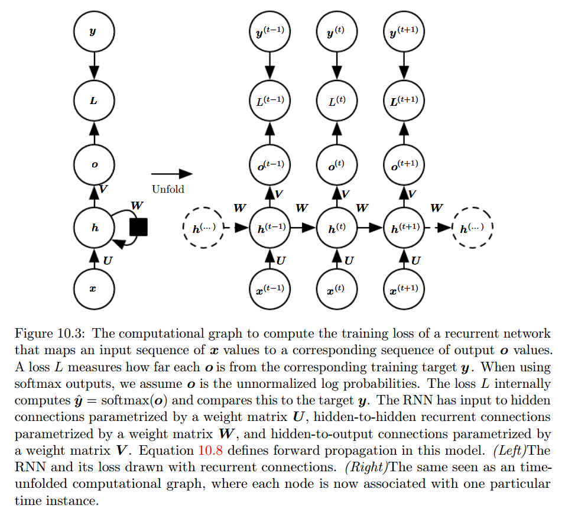
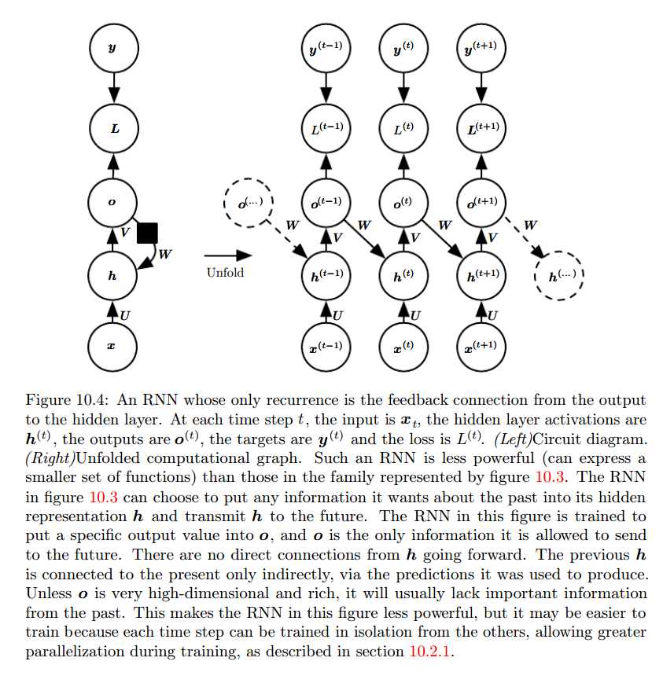
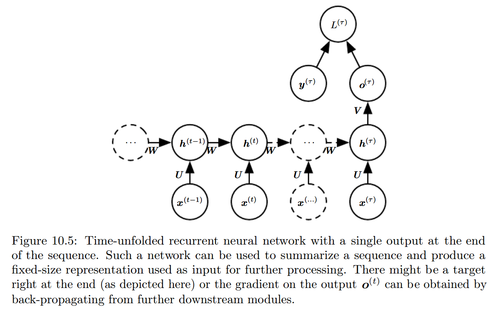
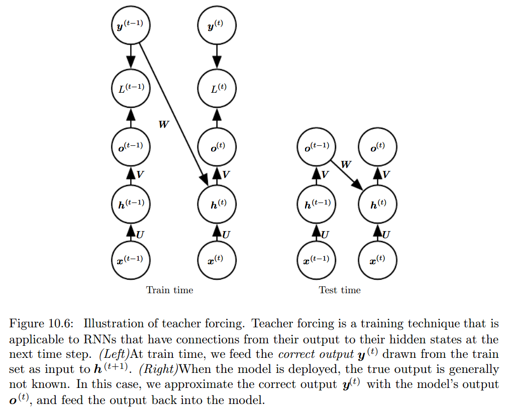
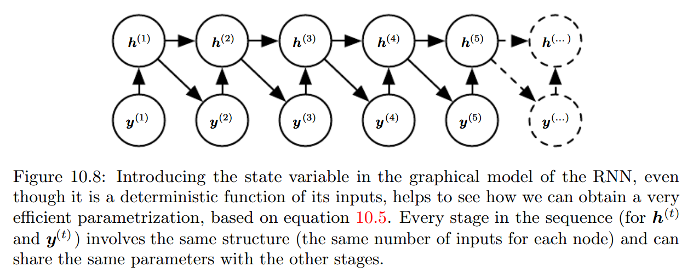
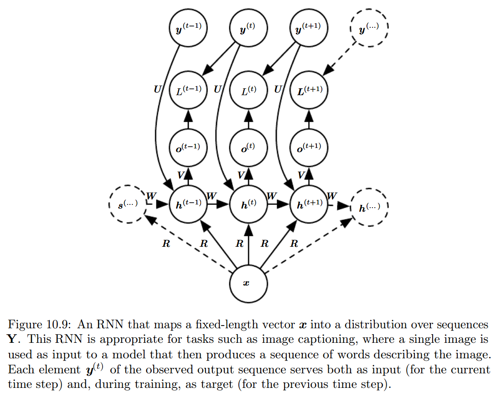
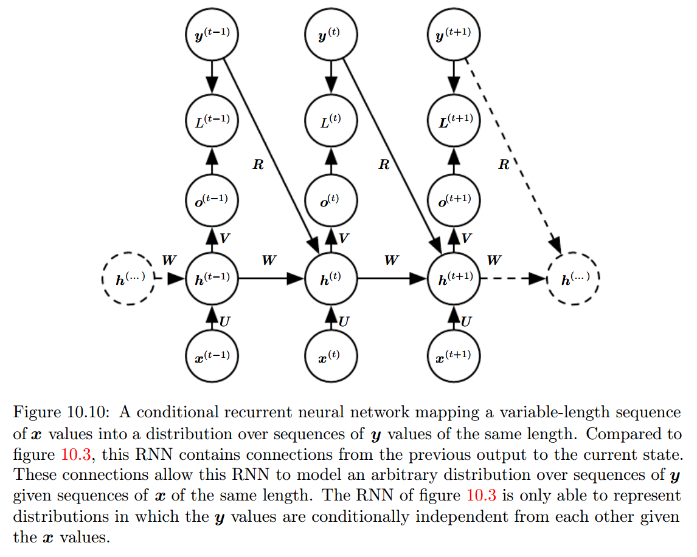
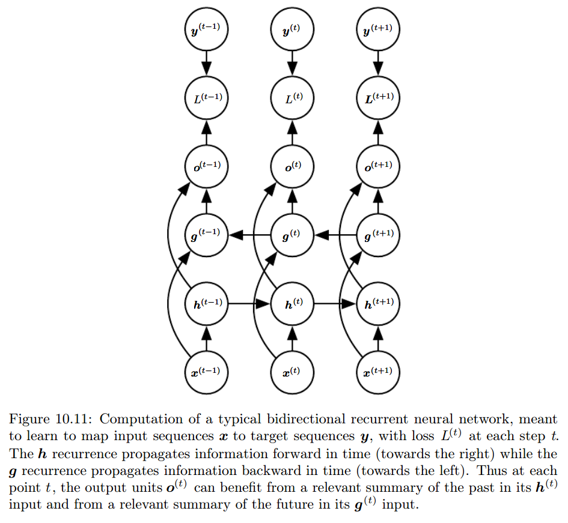
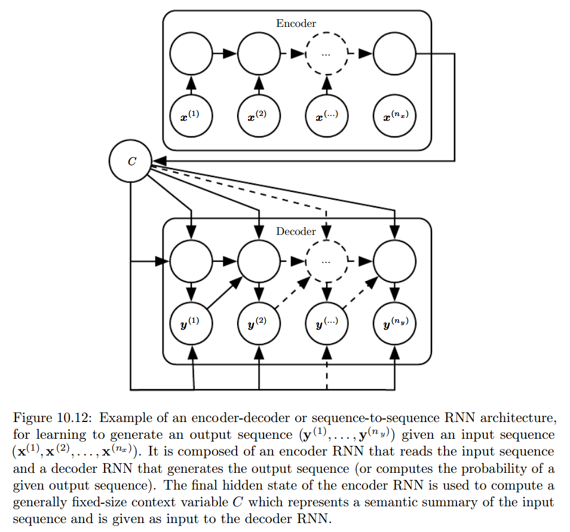
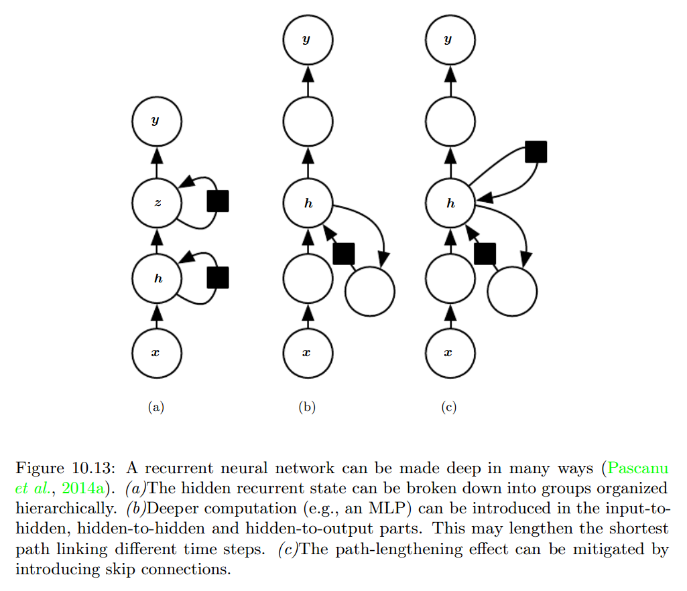

本文记录了《Deep Learning》[@goodfellow2016deep]的读后感。

<!--more-->

## 介绍

许多人工智能任务依赖于正确的特征集，即表示。但很多情况下，人们不知道该选取哪些特
征。所以需要使用机器学习发现表示（特征集）。

自编码器组合编码函数，在保留尽可能多的信息的同时让新表示满足一些特性。

## Linear Algebra

### 范数

范数
: 满足以下性质的任意函数 $f$

  - $f(\bm{x}) = 0 \Rightarrow \bm{x} = \bm{0}$
  - $f(\bm{x} + \bm{y}) \le f(\bm{x}) + f(\bm{y})$ （三角不等式）
  - $\forall \alpha \in \mathbb{R}, f(\alpha\bm{x}) = |\alpha|f(\bm{x})$

$L^p$ 范数：
$$||\bm{x}||_p = \left(\sum_i |x_i|^p\right)^{\frac{1}{p}}$$ {#eq:Lp}
其中 $p \in \mathbb{R}, p \ge 1$。

$L^2$ 范数为 Euclidean 距离。

- $L^2$ 范数平方的优点
    - 计算简单
        - 偏微分只取决于 $x_i$，与其他 $x_j$ 没有关系
- $L^2$ 范数平方的缺点
    - 在原点附近变化缓慢

- $L^1$ 范数的优点
    - 在原点附近变化较快，可以区分 $0$ 和接近于 $0$ 的值

“$L^0$” 范数表示向量里非零元素的个数。（叫法不正确）

$L^\infty$ 范数或者最大范数：
$$||\bm{x}||_\infty = \max_i|x_i|$$ {#eq:LInfty}

Frobenius 范数为：
$$||\bm{A}|| = \sqrt{\sum_{i, j}A_{i, j}^2}$$ {#eq:frobeniusNorm}

点积可以用范数表示：
$$\bm{x}^T\bm{y} = ||\bm{x}||_2 ||\bm{y}||_2 \cos\theta$$ {#eq:dotProduct}

## Probability and Information Theory

### Bayes' Rule

$$P(\textrm{x}|\textrm{y}) = \frac{P(\textrm{x})P(\textrm{y}|\textrm{x})}{P(\textrm{y})}$$ {#eq:bayesRule}

### 常见概率分布

#### Gaussian Distribution

$$\mathcal{N}(x;\mu, \sigma^2) = \sqrt{\frac{1}{2\pi\sigma^2}}\exp\left(-\frac{1}{2\sigma^2}(x-\mu)^2\right)$$ {#eq:gaussianDistribution}
为了计算的简便，也可以用 $\beta^{-1} = \sigma^2$ 替代 $\sigma^2$ 作为参数，其中
$\beta \in (0, \infty)$，表示精度。

Gaussian 分布应用广泛的原因：

- 中心极限定理表明许多独立随机变量的和接近于正态分布；
- 同方差的所有分布里，正态分布的不确定性最大，意味着向模型插入了最少的先验知识。

$$\mathcal{N}(\bm{x};\bm{\mu},\bm{\Sigma}) = \sqrt{\frac{1}{(2\pi)^n\det(\bm{\Sigma})}}\exp\left(-\frac{1}{2}(\bm{x}-\bm{\mu})^\mathsf{T}\bm{\Sigma}^{-1}(\bm{x}-\bm{\mu})\right)$$ {#eq:gaussianDistributionMulti}

#### 指数和 Laplace 分布

Laplace 分布
: $$\textrm{Laplace}(x;\mu,\gamma) = \frac{1}{2\gamma}\exp\left(-\frac{|x-\mu|}{\gamma}\right)$$ {#eq:laplaceDistribution}

### 混合分布

$$P(\bm{\textrm{x}}) = \sum_{i}P(\textrm{c}=i)P(\bm{\textrm{x}} \mid \textrm{c}=i)$$ {#eq:distributionMixture}

Gaussian 混合
: $P(\bm{\textrm{x}} \mid \textrm{c}=i)$ 为 Gaussian 分布。

万能近似器
: Gaussian 混合。

### 常见函数

logistic sigmoid:
$$\sigma(x) = \frac{1}{1 + \exp(-x)}$$ {#eq:sigmoid}
因为取值范围是 $(0, 1)$，所以用来产生 Bernoulli 分布的 $\phi$ 参数。

softplus:
$$\zeta(x) = \log(1 + \exp(x))$$ {#eq:softplus}
因为取值范围是 $(0, \infty)$，所以用来产生正态分布的 $\beta$ 或 $\sigma$ 参数。
之所以叫 softplus 是因为它是
$$x^+ = \max(0, x)$$ {#eq:plus}
的光滑版。

Rectified Linear Unit(ReLU):
$$g(z) = \max(0, z)$$ {#eq:relu}
只要激活，梯度即为 $1$，相比于 sigmoid 更加容易学习。

tanh:
$$\tanh(x) = \frac{e^x - e^{-x}}{e^x + e^{-x}}$$ {#eq:tanh}
$\tanh(0) = 0$，更类似于单位函数。

Radial basis function (RBF):
$$h_i = \exp\left(-\frac{1}{\sigma_i^2}\left\lVert\bm{W}_{:,i} - \bm{x}\right\rVert^2\right)$$ {#eq:rbf}
当 $\bm{x}$ 接近模板 $\bm{W}_{:,i}$ 时，函数激活；此外大部分情况不激活，所以难于
优化。

### 信息论

Kullback-Leibler (KL) 散度：
$$D_{\textrm{KL}}(P||Q) = \mathbb{E}_{\textrm{x} \sim P}\left[\log\frac{P(x)}{Q(x)}\right] = \mathbb{E}_{\textrm{x} \sim P}[\log P(x)-\log Q(x)]$$ {#eq:klDivergence}
描述了概率分布 $P(\textrm{x})$ 和 $Q(\textrm{x})$ 的区别有多大。KL 散度非负，当
且仅当 $P(\textrm{x})$ 和 $Q(\textrm{x})$ 处处相等[^klEqualEverywhere]时
$D_{\textrm{KL}}(P||Q) = 0$。但 KL 散度不对称：对于某些 $P$ 和 $Q$，
$D_{\textrm{KL}}(P||Q) \neq D_{\textrm{KL}}(Q||P)$。

交叉信息熵：
$$H(P, Q) = -\mathbb{E}_{\textrm{x} \sim P} \log Q(x)$$ {#eq:crossEntropy}
KL 散度和交叉信息熵之间的关系：$H(P, Q) = H(P) + D_{\textrm{KL}}(P||Q)$。

[^klEqualEverywhere]: 当 $\textrm{x}$ 为离散随机变量时，需要处处相等；当
    $\textrm{x}$ 为连续随机变量时，需要几乎处处相等。

## 数值计算

### 上溢和下溢

下溢
: 接近于 $0$ 的数取整为 $0$。

下溢
: 大数近似成 $\infty$ 或者 $-\infty$。

为了使数值计算稳定，需要把 softmax 里的 $x$ 换成 $x - \max_i x_i$。

### 病态条件

矩阵条件数

: $\kappa(\bm{A}) = \lVert \bm{A}^{-1}\rVert \cdot \lVert\bm{A}\rVert$。当范数选
  $L^2$ 范数，且 $\bm{A}$ 为正规矩阵时，$\kappa(\bm{A}) =
  \left\lvert\frac{\lambda_{max}(\bm{A})}{\lambda_{min}(\bm{A})}\right\rvert$。
  其中，$\lambda_{max}(\bm{A})$ 和 $\lambda_{min}(\bm{A})$ 分别为 $\bm{A}$ 的极
  大和极小（根据模数）特征值。当条件数较大时，矩阵求逆对输入错误非常敏感，此时称
  矩阵为病态条件的矩阵。

### 梯度之外：Jacobian 和 Hessian 矩阵

Jacobian 矩阵
: 对一个函数 $\bm{f}:\mathbb{R}^m \to \mathbb{R}^n$ 来说，
  $$\bm{J}_{i, j} = \frac{\partial}{\partial x_j} f(\bm{x})_i$$ {#eq:jacobianMatrix}
  为其 Jacobian 矩阵，$\bm{J} \in \mathbb{R}^{n\times m}$。

Hessian 矩阵
: 对一个函数 $f: \mathbb{R}^n \to \mathbb{R}$ 来说，
  $$\bm{H}(f)(\bm{x})_{i, j} = \frac{\partial^2}{\partial x_i\partial x_j}f(\bm{x})$$ {#eq:hessianMatrix}
  为其 Hessian 矩阵。

Hessian 矩阵的条件数描述了二阶导数有多大区别。

{#fig:hessianMatrixConditionNumber}

### 有约束的优化

扩展 Lagrange 函数
: $$L(\bm{x}, \bm{\lambda}, \bm{\alpha}) = f(\bm{x}) + \sum_i \lambda_i g^{(i)}(\bm{x}) + \sum_j \alpha_j h^{(j)}(\bm{x})$$ {#eq:generalizedLagrange}

有约束的最小化
: $$\min_{\bm{x}}\max_{\bm{\lambda}}\max_{\bm{\alpha}, \bm{\alpha} \le 0}L(\bm{x}, \bm{\lambda}, \bm{\alpha})$$ {#eq:constrainedMin}

KKT 条件（有约束优化的最优点的必要条件）
: - 扩展 Lagrange 函数的梯度为 $0$；
 - 满足 $\bm{x}$ 和 KKT 乘子（$\bm{\lambda}, \bm{\alpha}$）的约束；
 - $\bm{\alpha} \odot \bm{h}(\bm{x}) = \bm{0}$。

活跃约束
: $h^{(i)}(\bm{x}^*) = 0$ 时称 $h^{(i)}(\bm{x})$ 为活跃的约束。

## Machine Learning Basics

### 学习算法

#### 例子：线性回归

均方误差
: $$\textrm{MSE}_{\textrm{test}} = \frac{1}{m}\sum_i (\hat{\bm{y}}^{(\textrm{test})} - \bm{y}^{(\textrm{test})})_i^2$$ {#eq:mse}

### 容量、过拟合和欠拟合

模型容量
: （非正式）拟合各类函数的能力。

表示容量
: 学习算法可以选择的函数家族。

有效容量
: 实际容量，小于表示容量。

最优容量
: 泛化误差最小时的模型容量。

### Maximum Likelihood Estimation（最大似然估计）

$$
\begin{align*}
\bm{\theta}_{\textrm{ML}} &= \arg\max_{\bm{\theta}}p_{\textrm{model}}(\mathbb{X;\bm{\theta}}) \\
&= \arg\max_{\bm{\theta}}\prod_{i=1}^m p_{\textrm{model}}(\bm{x}^{(i)};\bm{\theta}) \\
&= \arg\max_{\bm{\theta}}\sum_{i=1}^m \log p_{\textrm{model}}(\bm{x}^{(i)};\bm{\theta}) \\
&= \arg\max_{\bm{\theta}}\mathbb{E}_{\textrm{x} \sim \hat{p}_{\textrm{data}}} \log p_{\textrm{model}}(\bm{x};\bm{\theta})
\end{align*}
$$ {#eq:mle}
其中，$\mathbb{X} = \{\bm{x}^{(1)},\dots,\bm{x}^{(m)}\}$

最大似然估计等价于最小化交叉信息熵 $H(\hat{P}_{\textrm{data}},P_{\textrm{model}})$。

### Maximum A Posteriori (MAP) Estimation（最大后验概率估计）

$$
\begin{align*}
\bm{\theta}_{\textrm{MAP}} &= \arg\max_{\bm{\theta}}p(\bm{\theta}|\mathbb{X}) \\
&= \arg\max_{\bm{\theta}}\log p(\mathbb{X}|\bm{\theta})p(\bm{\theta}) \\
&= \arg\max_{\bm{\theta}}\left[\sum_{i=1}^m\log p(\bm{x}^{(i)}|\bm{\theta}) + \log p(\bm{\theta})\right]
\end{align*}
$$ {#eq:map}
先验分布为 $\mathcal{N}(\bm{w}; \bm{0}, \frac{1}{\lambda}\bm{I}^2)$ 时，先验项对
应于最大似然估计里的权重衰减。

### 非监督学习算法

低维表示
: 用小的表示压缩尽可能多的信息。

稀疏表示
: 大部分元素为 0。

独立表示
: 解耦数据分布的协方差以使各个维度统计独立。

### 构建一个机器学习算法

决策树和 k 平均不适用梯度优化，因为它们的损失函数有平坦区域。

## 深度前馈网络

MLPs
: Multilayer Perceptrons。

### 架构设计

万能近似定理
: 有一层线性输出层和至少一层任意激活函数的隐藏层的前馈网络，如果有足够多的隐藏单
  元，就可以以任意小的非零误差近似从一个有限维空间到另一个有限维空间的 Borel 可
  测函数。

深度矫正网络（ReLU？）表示的函数在单隐藏层网络里可能需要指数次隐藏单元。具体地，
深度矫正网络可以表示的线性区域数量为：
$$O\left(\binom{n}{d}^{d(l-1)}n^d\right)$$ {#eq:deepNetworkCapacity}
其中，$d$ 为输入层单元数量，$l$ 为深度，$n$ 为隐藏层单元数量。

### 历史说明

均方误差容易饱和，学习速度慢。

分段线性函数在某些点不可微，但学习速度快。

## 深度学习的正则化

### 参数范数惩罚

我们只惩罚权重项，不惩罚偏置项。因为偏置项不会导致过拟合，而惩罚偏置项会导致欠拟
合。

每一层使用单独的惩罚系数 $\alpha$ 更精确，但搜索空间更大。所有层使用相同的
$\alpha$ 会减少搜索空间。

#### $L^2$ 参数正则化

当目标函数是二次函数时，可以近似为：
$$\hat{J}(\bm{\theta}) = J(\bm{w}^{\ast}) + \frac{1}{2}(\bm{w}-\bm{w}^{\ast})^{\mathsf{T}}\bm{H}(\bm{w}-\bm{w}^{\ast})$$ {#eq:JHat}
其中，$\bm{H}$ 是 $J$ 关于 $\bm{w}$ 在 $\bm{w}^{\ast}$ 处的 Hessian 矩阵。对[@eq:JHat]
两边同时求导，可得：
$$\nabla_{\bm{w}}\hat{J}(\bm{w}) = \bm{H}(\bm{w}-\bm{w}^{\ast})$$ {#eq:gradientJHat}
在让 $\hat{J}$ 取得最小值的 $\bm{w}^{\ast}$ 处，$\nabla_{\bm{w}}\hat{J}(\bm{w})
= \bm{H}(\bm{w}-\bm{w}^{\ast})=\bm{0}$。加入惩罚项后，目标函数变为：
$$\tilde{J}(\bm{w};\bm{X},\bm{y}) = \frac{\alpha}{2}\bm{w}^{\mathsf{T}}\bm{w} + J(\bm{w};\bm{X},\bm{y})$$ {#eq:JTilde}
由新梯度为 $0$ 可得：
$$\alpha\tilde{\bm{w}} + \bm{H}(\tilde{\bm{w}} - \bm{w}^{\ast}) = 0 $$
即：
$$\tilde{\bm{w}} = (\bm{H} + \alpha\bm{I})^{-1}\bm{H}\bm{w}^{\ast}$$ {#eq:tildeW}
因为 $\bm{H}$ 是实对称矩阵，所以存在正交基组成的矩阵 $\bm{Q}$ 和对角矩阵
$\bm{\Lambda}$，使得 $\bm{H} = \bm{Q}\bm{\Lambda}\bm{Q}^{\mathsf{T}}$。可得，
$$
\begin{align*}
\tilde{\bm{w}} &= (\bm{Q}\bm{\Lambda}\bm{Q}^{\mathsf{T}} + \alpha\bm{I})^{-1}\bm{Q}\bm{\Lambda}\bm{Q}^{\mathsf{T}}\bm{w}^{\ast} \\
&= \left[\bm{Q}(\bm{\Lambda} + \alpha\bm{I})\bm{Q}^{\mathsf{T}}\right]^{-1}\bm{Q}\bm{\Lambda}\bm{Q}^{\mathsf{T}}\bm{w}^{\ast} \\
&= \bm{Q}(\bm{\Lambda}+\alpha\bm{I})^{-1}\bm{\Lambda}\bm{Q}^{\mathsf{T}}\bm{w}^{\ast}
\end{align*}
$$ {#eq:tildeW1}
即与 $\bm{H}$ 第 $i$ 个特征向量平行的分量会缩减为原来的
$\frac{\lambda_i}{\lambda_i + \alpha}$。$\bm{H}$ 特征值大的方向受影响小，特征值
小的方向会被缩减为 $0$。

#### $L^1$ 参数正则化

$L^2$ 正则化等价于使用权重为 Gaussian 先验分布的最大后验 Bayesian 推断；$L^{1}$
正则化等价于使用权重为各向同性 Laplace 分布的最大后验 Bayesian 推断。

### 正则化和欠约束问题

$\bm{X}^{\mathsf{T}}\bm{X}$ 有可能是奇异矩阵。比如样本分布在某些方向没有变化，或
者因为样本数少于特征数而没有可观察到的变化。而正则化后变为对
$\bm{X}^{\mathsf{T}}\bm{X} + \alpha\bm{I}$ 求逆，这个矩阵一定是非奇异的。

还有一些问题没有闭合解。正则化会阻止 $\bm{w}$ 无限增大。

### 数据集扩充

在神经网络的输入里加入噪声可以看成扩充数据。在隐藏单元里加入噪声可以看成在多级别
的抽象里扩充数据。Dropout 可以看成通过乘噪声来构建新输入。

### 噪声健壮性

权重上加噪声可以解释成传统的正则化。

### 多任务学习

1. 神经网络后面的层是任务相关的参数；
2. 前面的层共享参数。

### 参数类型和参数共享

参数共享只需要存储共享的参数，占用内存较小。

### Dropout

Bagging 与 Dropout 的异同点：

- Bagging 训练时，所有模型都是独立的；Dropout 里，不同模型共享参数，占用内存少；
- Bagging 用各自的样本集训练每个模型；Dropout 不显式训练每个模型，每一步只训练某
  个子网络的一部分；
- 除此之外，Bagging 和 Dropout 很像。

Dropout 的优点：

- Dropout 计算成本很低；
- Dropout 不怎么限制模型类型和训练过程。

Dropout 需要更大的模型和更多的迭代次数。

## 训练深度模型的优化

### 学习与纯优化有何不同

#### 批处理和迷你批处理算法

迷你批处理的大小受以下因素驱动：

- 数量越大，对梯度的估计越准确，但线性收益越少；
- 数量太小无法充分利用多核架构，所以有绝对最小批处理数量；
- 同一批次的样本并行处理的话占用内存与批处理数量成正比，内存资源限制批处理数量的
  大小；
- 一些硬件架构对特定长度的数组性能更好，比如 GPU，对 2 的幂次的批处理数量性能更好；
- 小的批处理有正则化效果，但需要更小的学习速率和更多迭代次数，因此时间更长。

### 神经网络优化中的挑战

#### 病态条件

Hessian 矩阵有可能为病态条件的矩阵。Newton 法在 Hessian 矩阵病态的情况下也可以最
小化凸函数，但在运用于神经网络之前需要做大量修改。

#### 局部最小值

可以画梯度范数随时间变化的曲线，如果梯度范数不随时间减小，就不是局部最小值或任何
关键点。

#### 平顶、鞍点或其他平坦区域

经验上，梯度下降常常能逃离鞍点。如果是大范围的常数值，即退化区域，所有的数值优化
都无能为力。

#### 悬崖和爆炸梯度

梯度悬崖可以用梯度裁剪改善。

#### 长期依赖

假设 $\bm{W}$ 有特征值分解 $\bm{W} =
\bm{V}\textrm{diag}(\bm{\lambda})\bm{V}^{-1}$，那么有
$$\bm{W}^t = (\bm{V}\textrm{diag}(\bm{\lambda})\bm{V}^{-1})^t = \bm{V}\textrm{diag}(\bm{\lambda})^t\bm{V}^{-1}$$ {#eq:gradientMultiply}
当 $\lvert\lambda_i\rvert > 1$ 时，梯度会爆炸，导致学习不稳定；当
$\lvert\lambda_i\rvert < 1$ 时，梯度会消失，导致不好判断向哪个方向优化。

前馈网络不同层的权重矩阵不一样，很大程度上可以避免这个问题。

### 基本算法

#### 随机梯度下降

通过画目标函数随时间变化的曲线来选择学习速率。如果学习速率太大，学习曲线会猛烈震
荡；如果学习速率太小，学习会很慢，并有可能停在高费用值上。一般地，初始学习速率要
高于在 100 来次迭代后产生最好效果的学习速率。

#### 动量

动量法更新规则：

$$\bm{v} \gets \alpha\bm{v} - \epsilon\nabla_{\bm{\theta}}\left(\frac{1}{m}\sum_{i=1}^{m}L(\bm{f}(\bm{x}^{(i)};\bm{\theta}),\bm{y}^{(i)})\right),$$ {#eq:updateV}
$$\bm{\theta} \gets \bm{\theta} + \bm{v}$$ {#eq:updateTheta}

动量法累积了历史梯度，误差方向会抵消，前进方向会加强，因此同时改善了 Hessian 矩
阵病态和随机梯度有方差的问题。

### 参数初始化策略

大部分初始化策略基于在初始化后符合某些性质，但我们并不确定在学习开始以后，何种情
况下何种性质会被保留。而且，有些初始值有利于优化，但不利于泛化。唯一确定的是，需
要打破不同单元间的对称性。

一般地，我们把偏置设成常数，而随机初始化权重。我们一般从 Gaussian 分布或者均匀分
布中随机取值。具体是用 Gaussian 分布还是均匀分布关系不大，重要的是初始值的大小。

较大的初始值可以更好地打破对称性。但太大了容易造成梯度爆炸、混乱（循环网络）或者
饱和。

梯度裁剪可以减缓梯度爆炸。

多种初始化策略：

- $W_{i, j} \sim U(-\frac{1}{m}, \frac{1}{m})$
- $W_{i, j} \sim U(-\sqrt{\frac{6}{m+n}}, \sqrt{\frac{6}{m+n}})$
- 随机的正交矩阵，并仔细选取增益 $g$
- 稀疏初始化（每个单元初始化成 $k$ 个非零权重）
- 超参数搜索算法

可以根据一次迷你批处理的激活值或者梯度的标准差或者范围来选择初始值的大小。如果权
重太小，激活值会减小。

偏置可以设成 $0$。但是，

- 输出单元的偏置最好设成输出的边缘统计；
- 避免饱和；
- 逻辑门可能需要设成 $1$。

### 自适应学习率算法

#### AdaGrad

- 求梯度：$\bm{g} \gets \frac{1}{m}\nabla_{\bm{\theta}}\sum_i L(f(\bm{x}^{(i)};\bm{\theta}),\bm{y}^{(i)})$
- 累计平方梯度：$\bm{r} \gets \bm{r} + \bm{g}\odot\bm{g}$
- 计算更新：$\Delta\bm{\theta} \gets -\frac{\epsilon}{\delta+\sqrt{\bm{r}}}\odot\bm{g}$
- 更新：$\bm{\theta} \gets \bm{\theta} + \Delta\bm{\theta}$

AdaGrad 适用于部分深度学习模型，但不是全部。

#### RMSProp

RMSProp 算法：

- 求梯度：$\bm{g} \gets \frac{1}{m}\nabla_{\bm{\theta}}\sum_i L(f(\bm{x}^{(i)};\bm{\theta}),\bm{y}^{(i)})$
- 累计平方梯度：$\bm{r} \gets \rho\bm{r} + (1-\rho)\bm{g}\odot\bm{g}$
- 计算更新：$\Delta\bm{\theta} \gets -\frac{\epsilon}{\sqrt{\delta+\bm{r}}}\odot\bm{g}$
- 更新：$\bm{\theta} \gets \bm{\theta} + \Delta\bm{\theta}$

带 Nesterov 动量的 RMSProp 算法：

- 临时更新：$\tilde{\bm{\theta}} \gets \bm{\theta} + \alpha\bm{v}$
- 求梯度：$\bm{g} \gets \frac{1}{m}\nabla_{\tilde{\bm{\theta}}}\sum_i L(f(\bm{x}^{(i)};\tilde{\bm{\theta}}),\bm{y}^{(i)})$
- 累计平方梯度：$\bm{r} \gets \rho\bm{r} + (1-\rho)\bm{g}\odot\bm{g}$
- 计算速度更新：$\bm{v} \gets \alpha\bm{v}-\frac{\epsilon}{\sqrt{\bm{r}}}\odot\bm{g}$
- 更新：$\bm{\theta} \gets \bm{\theta} + \bm{v}$

经验上，RMSProp 算法有效且实用。

#### Adam

- 求梯度：$\bm{g} \gets \frac{1}{m}\nabla_{\bm{\theta}}\sum_i L(f(\bm{x}^{(i)};\bm{\theta}),\bm{y}^{(i)})$
- 更新有偏一阶动量估计：$\bm{s} \gets \rho_1\bm{s} + (1-\rho_1)\bm{g}$
- 更新有偏二阶动量估计：$\bm{r} \gets \rho_2\bm{r} + (1-\rho_2)\bm{g}\odot\bm{g}$
- 纠正一阶动量：$\hat{\bm{s}} \gets \frac{\bm{s}}{1-\rho_1^t}$
- 纠正二阶动量：$\hat{\bm{r}} \gets \frac{\bm{r}}{1-\rho_2^t}$
- 计算更新：$\Delta\bm{\theta} \gets -\frac{\epsilon}{\delta+\sqrt{\hat{\bm{r}}}}\hat{\bm{s}}$
- 更新：$\bm{\theta} \gets \bm{\theta} + \Delta\bm{\theta}$

Adam 算法对超参数的选择很健壮。

### 二阶近似方法

#### Newton 法

$$J(\bm{\theta})\approx J(\bm{\theta}_0) + (\bm{\theta}-\bm{\theta}_0)^{\mathsf{T}}\nabla_{\bm{\theta}}J(\bm{\theta}_0) + \frac{1}{2}(\bm{\theta}-\bm{\theta}_0)^{\mathsf{T}}\bm{H}(\bm{\theta}-\bm{\theta}_0)$$
$$\bm{\theta}^{\ast} = \bm{\theta}_0 - \bm{H}^{-1}\nabla_{\bm{\theta}}J(\bm{\theta}_0)$$

在深度学习里，目标函数不一定正定，因此要加正则项：

$$\bm{\theta}^{\ast} = \bm{\theta}_0 - (\bm{H} + \alpha\bm{I})^{-1}\nabla_{\bm{\theta}}J(\bm{\theta}_0)$$

深度学习里 Newton 法的缺点：

- $\alpha$ 要能够抵消负的特征值，但太大的话 Hessian 矩阵的作用会变小，学习率可能
  会比梯度下降法还小。
- 计算 Hessian 矩阵的逆矩阵需要 $O(k^3)$ 复杂度。

#### 共轭梯度法

假如 $\bm{d}_t^{\mathsf{T}}\bm{H}\bm{d}_{t-1} = 0$，则称 $\bm{d}_t$ 和
$\bm{d}_{t-1}$ 共轭。

$$\bm{d}_t = \nabla_{\bm{\theta}}J(\bm{\theta}) + \beta_t\bm{d}_{t-1}$$

Fletcher-Reeves 方法：

$$\beta_t = \frac{\nabla_{\bm{\theta}}J(\bm{\theta_t})^{\mathsf{T}}\nabla_{\bm{\theta}}J(\bm{\theta_t})}{\nabla_{\bm{\theta}}J(\bm{\theta_{t-1}})^{\mathsf{T}}\nabla_{\bm{\theta}}J(\bm{\theta_{t-1}})}$$

Polak-Ribiere 方法：

$$\beta_t = \frac{(\nabla_{\bm{\theta}}J(\bm{\theta_t})-\nabla_{\bm{\theta}}J(\bm{\theta}_{t-1}))^{\mathsf{T}}\nabla_{\bm{\theta}}J(\bm{\theta_t})}{\nabla_{\bm{\theta}}J(\bm{\theta_{t-1}})^{\mathsf{T}}\nabla_{\bm{\theta}}J(\bm{\theta_{t-1}})}$$

共轭梯度法：

- 求梯度：$\bm{g}_t \gets \frac{1}{m}\nabla_{\bm{\theta}}\sum_i L(f(\bm{x}^{(i)};\bm{\theta}),\bm{y}^{(i)})$
- 计算 $\beta_t$：$\beta_t = \frac{(\bm{g}_t - \bm{g}_{t-1})^{\mathsf{T}}\bm{g}_t}{\bm{g}_{t-1}^{\mathsf{T}}\bm{g}_{t-1}}$（Polak-Ribiere）
- 计算搜索方向：$\bm{\rho}_t = -\bm{g}_t + \beta_t\bm{\rho}_{t-1}$
- 在线上搜索找到 $\epsilon^{\ast}$：$\epsilon^{\ast} = \textrm{argmin}_{\epsilon}\frac{1}{m}\sum_i^m L(f(\bm{x}^{(i)};\bm{\theta}_t+\epsilon\bm{\beta}_t),\bm{y}^{(i)})$
- 更新：$\bm{\theta}_{t+1} = \bm{\theta}_t + \epsilon^{\ast}\bm{\rho}_t$

非线性共轭梯度在未变化的梯度方向上会重置。

#### BFGS

用 $\bm{M}_t$ 近似 $\bm{H}^{-1}$。减少了计算复杂度，但需要存储 $\bm{M}_t$。

Limited Memory BFGS (L-BFGS) 假定 $\bm{M}_{t-1} = \bm{I}$，而不是存储它。

### 优化策略和元算法

#### 批量初始化

批量初始化：

$$\bm{H}' = \frac{\bm{H}-\bm{\mu}}{\bm{\sigma}}$$
其中，
$$\bm{\mu} = \frac{1}{m}\sum_i\bm{H}_{i, :}$$
$$\bm{\sigma}=\sqrt{\delta + \frac{1}{m}\sum_i(\bm{H} - \bm{\mu})_i^2}$$
$\delta$ 用来防止数值溢出。

批量初始化让低层层失效了，从而减小了高阶近似的影响。

为了保留模型的表达力，通常使用 $\bm{\gamma}\bm{H}' + \bm{\beta}$ 而不是
$\bm{H}'$（这里取消了不同层之间的耦合）。

## 卷积网络

### 动机

如果 $f(g(x)) = g(f(x))$，则称函数 $f(x)$ 相对于函数 $g$ 等变。卷积函数平移等变。

### pooling

- pooling 有助于使表示变为对于较小输入平移的近似不变量，可以极大地提高网络的统计
  效率；
- 如果对不同卷积的输出 pooling，可以学习对变换不变的特征；
- pooling 可以实现降采样，有助于提高统计效率、减少内存占用；
- pooling 可以处理不同大小的输入。

### 卷积和 pooling 作为无限强的先验分布

### 基本卷积函数的变体

$$Z_{i,j,k} = \sum_{l,m,n} V_{l,j+m-1,k+n-1}K_{i,l,m,n}$$
其中，$K_{i,j,k,l}$ 表示输出通道 $i$ 与输入通道 $j$ 中，输出单元与输入单元之间偏
移量为 $k$ 行、$l$ 列的 2 个单元之间的连接强度；$V_{i,j,k}$ 表示通道 $i$ 在 $j$
行 $k$ 列的观察数据；$\bm{Z}$ 指输出。

降采样卷积：
$$Z_{i,j,k} = c(\bm{K}, \bm{V}, s)_{i,j,k} = \sum_{l,m,n} [V_{l,(j-1)\times s+m,(k-1)\times s+n}K_{i,l,m,n}]$$

有效卷积
: 不补 0。

同体积卷积
: 补 0，以使体积不变。

全卷积
: 补足够的 0，以使每个输入像素点被访问 k 次。

不共享卷积
: $Z_{i,j,k} = \sum_{l,m,n} [V_{l,j+m-1,k+n-1}w_{i,j,k,l,m,n}]$

平铺卷积
: $Z_{i,j,k} = \sum_{l,m,n} V_{l,j+m-1,k+n-1}K_{i,l,m,n,j\%t+1,k\%t+1}$

## 序列模型：循环和递归网络

### 展开计算图

$$\bm{h}^{(t)} = f(\bm{h}^{(t-1)}, \bm{x}^{(t)};\bm{\theta})$$

### 循环神经网络

{#fig:rnn1}

$$\bm{a}^{(t)} = \bm{b} + \bm{W}\bm{h}^{(t-1)} + \bm{U}\bm{x}^{(t)}$$
$$\bm{h}^{(t)} = \tanh(\bm{a}^{(t)})$$
$$\bm{o}^{(t)} = \bm{c} + \bm{V}\bm{h}^{(t)}$$
$$\hat{\bm{y}}^{(t)} = \textrm{softmax}(\bm{o}^{(t)})$$
$$
\begin{align*}
& L\left(\{\bm{x}^{(1)},\dots,\bm{x}^{(\tau)}\}, \{\bm{y}^{(1)},\dots,\bm{y}^{(\tau)}\}\right) \\
=& \sum_t L^{(t)} \\
=& - \sum_t\log p_{\textrm{model}}\left(\bm{y}^{(t)}|\{\bm{x}^{(1)},\dots,\bm{x}^{(t)}\}\right)
\end{align*}
$$

RNN 1 是图灵完备的。向后传播需要 $O(\tau)$ 的时间复杂度和空间复杂度，称作
back-propagation through time (BPTT)。它很强大，但训练代价也高。

{#fig:rnn2}

{#fig:rnn3}

#### Teacher Forcing and Networks with Output Recurrence

{#fig:teacherForcing}

RNN 2 严格地不如 RNN 1 强大，但是可以通过 Teacher forcing 解耦不同时刻的计算，从
而并行计算。

#### 循环网络作为离散图模型

{#fig:rnnStateVariable}

循环网络减少了参数，但不好优化。

#### Modeling Sequences Conditioned on Context with RNNs

{#fig:rnnFixedLengthX}

{#fig:rnnVariableLengthX}

### 双向 RNNs

{#fig:bidirectionalRNN}

### Encoder-Decoder Sequence-to-Sequence Architectures

{#fig:sequenceToSequenceRNN}

最大化平均 $\log
P(\bm{y}^{(1)},\dots,\bm{y}^{(n_y)}|\bm{x}^{(1)},\dots,\bm{x}^{(n_x)})$ 。

### 深度循环网络

{#fig:deepRNN}

## 应用

### 自然语言处理

#### 高维输出

重要度采样不仅加速高维 softmax 输出的计算，也可以加速稀疏输出层的计算。

## 线性因子模型

先采样解释因子 $\bm{h}$：
$$\bm{h} \sim p(\bm{h})$$
其中，$p(\bm{h}) = \prod_i p(h_i)$。接着采样观察变量：
$$\bm{x} = \bm{W}\bm{h} + \bm{b} + \textrm{noise}$$
其中噪声通常是 Gaussian 分布且为对角的（不同维度间独立）。

### 概率主成分分析与因子分析

因子分析
: $$\bm{h} \sim \mathcal{N}(\bm{h};\bm{0},\bm{I})$$
  观察变量 $x_i$ 在给定 $\bm{h}$ 的情况下条件独立。特别地，噪声的协方差矩阵
  $\bm{\psi} = \textrm{diag}(\bm{\sigma}^2)$。

  $$\bm{x} \sim \mathcal{N}(\bm{x};\bm{b},\bm{W}\bm{W}^{\mathsf{T}} + \bm{\psi})$$

概率主成分分析
: $$\bm{x} \sim \mathcal{N}(\bm{x};\bm{b},\bm{W}\bm{W}^{\mathsf{T}} + \sigma^2\bm{I})$$
  或者等价的，$$\bm{x} = \bm{W}\bm{h} + \bm{b} + \sigma\bm{z}$$
  其中 $\bm{z} \sim \mathcal{N}(\bm{z};\bm{0},\bm{I})$。

### Independent Component Analysis (ICA)

选择 $p(\bm{h})$，使其互相独立。

## Autoencoders

传统上，autoencoders 用于降维或者特征学习；最近，autoencoders 与隐藏变量理论上的
联系把它带进了生成模型的前沿。

### Undercomplete Autoencoders

Undercomplete
: 编码维度小于输入维度的自动编码器。

损失函数：
$$L(\bm{x}, g(f(\bm{x})))$$

当解码器为线性且 $L$ 为均方误差时，欠完成自动编码器等价于 PCA。当编码函数 $f$ 为
非线性时，欠完成自动编码器是 PCA 的非线性推广。

### Regularized Autoencoders

可以通过要求表示稀疏、表示的导数小和对噪声或丢失输入的健壮性来惩罚自动编码器，从
而避免产生无效的自动编码器。

#### Sparse Autoencoders

损失函数：
$$L(\bm{x}, g(f(\bm{x}))) + \Omega(\bm{h})$$
典型地，$\bm{h} = f(\bm{x})$。

稀疏自动编码器主要为另一个任务，比如分类，学习特征。

$$\log p_{\textrm{model}}(\bm{h}, \bm{x}) = \log p_{\textrm{model}}(\bm{h}) + \log p_{\textrm{model}}(\bm{x}|\bm{h})$$
假如隐藏变量的先验分布为 Laplace 分布：
$$p_{\textrm{model}}(h_i) = \frac{\lambda}{2}e^{-\lambda|h_i|}$$
则
$$-\log p_{\textrm{model}}(\bm{h}) = \sum_i \left(\lambda|h_i| - \log\frac{\lambda}{2}\right)$$
$$\Omega(\bm{h}) = \lambda\sum_i|h_i|$$

#### Denoising Autoencoders

Denoising Autoencoders（DAE）的损失函数：
$$L(\bm{x}, g(f(\tilde{\bm{x}})))$$
其中 $\tilde{\bm{x}}$ 是加了噪声的 $\bm{x}$。

#### 惩罚导数

损失函数：
$$L(\bm{x}, g(f(\bm{x}))) + \Omega(\bm{h}, \bm{x})$$
$$\Omega(\bm{h}, \bm{x}) = \lambda\sum_i\lVert \nabla_{\bm{x}}h_i\rVert^2$$

又称 contractive autoencoder (CAE)，与降噪自动编码器、manifold 学习和概率模型有
理论上的联系。

### 用自动编码器学习流形

### 自动编码器的应用

自动编码器成功地应用在了降维和信息提取任务上。

## Monte Carlo 方法

### Markov 链 Monte Carlo 方法

转移分布：
$$T(\bm{x}'|\bm{x})$$
表示从状态 $\bm{x}$ 转移到状态 $\bm{x}'$ 的概率。
转移矩阵：
$$A_{i, j} = T(\bm{x}'=i|\bm{x}=j)$$
则
$$\bm{v}^{(t)} = \bm{A}\bm{v}^{(t-1)}$$
那么
$$\bm{v}^{(t)} = \bm{A}^{t}\bm{v}^{(0)} = \bm{V}\textrm{diag}(\bm{\lambda})^{t}\bm{V}^{-1}\bm{v}^{(0)}$$
收敛时，
$$\bm{v}' = \bm{A}\bm{v} = \bm{v}$$
达到了稳态分布，或称平衡分布。

$x$ 连续时，平衡状态为：
$$q'(\bm{x'}) = \mathbb{E}_{\bm{x}\sim q}T(\bm{x'}|\bm{x})$$

### Gibbs 采样

Gibbs 采样
: 选择一个变量 $x_i$, 在给定无向图（定义了基于能量模型的结构）里的邻居的条件下从
  $p_{\textrm{model}}$ 采样，即可采样 $T(\bm{x'}|\bm{x})$。

## 参考文献
