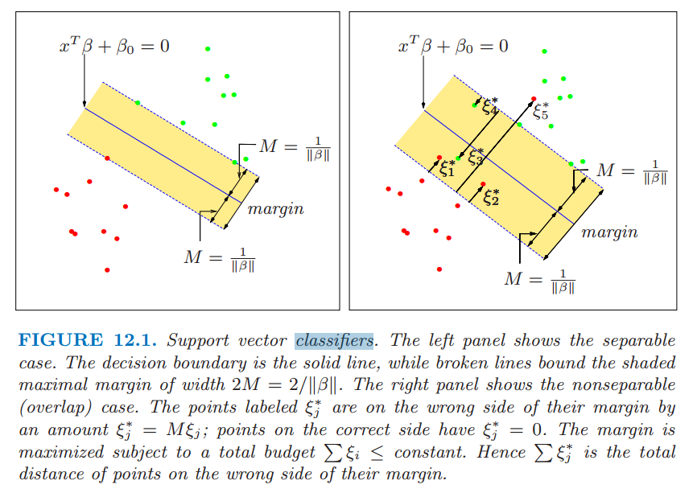

本文介绍了 SVM (Support Vector Machine)[@friedman2001elements]。

<!--more-->

## 优化目标

支持向量机用于二分类问题，优化目标是找一个超平面把两个类分开，且此超平面到两个分
类的距离越大越好。即找一个超平面：
$${\bm{x}: f(\bm{x}) = \bm{x}^{\mathsf{T}}\bm{\beta} + \beta_0}$$
分类标准为：
$$G(\bm{x}) = \textrm{sign}(\bm{x}^{\mathsf{T}}\bm{\beta} + \beta_0)$$

我们先看线性可分的情况。

### 线性可分

优化目标：
$$\min_{\bm{\beta}, \beta_0} \lVert\bm{\beta}\rVert$$
$$y_i(\bm{x_i}^{\mathsf{T}}\bm{\beta} + \beta_0) \ge 1, i = 1, 2, \dots, N$$

### 线性不可分

优化目标：
$$\min_{\bm{\beta}, \beta_0} \lVert\bm{\beta}\rVert$$
$$y_i(\bm{x_i}^{\mathsf{T}}\bm{\beta} + \beta_0) \ge 1 - \xi_i, \forall i$$
$$\xi_i \ge 0$$
$$\sum \xi_i \le \textrm{constant}$$

优化目标如[@fig:svm] 所示。 

{#fig:svm}

## 计算

优化目标等价于：
$$\min_{\bm{\beta}, \beta_0} \frac{1}{2}\lVert\bm{\beta}\rVert^2 + C\sum_{i=1}^M \xi_i$$
$$y_i(\bm{x_i}^{\mathsf{T}}\bm{\beta} + \beta_0) \ge 1 - \xi_i, \forall i$$
$$\xi_i \ge 0$$

相应的 Lagrange 函数为：
$$L_P = \frac{1}{2}\lVert\bm{\beta}\rVert^2 + C\sum_{i=1}^M \xi_i - \sum_{i=1}^N\alpha_i[y_i(\bm{x_i}^{\mathsf{T}}\bm{\beta} + \beta_0) - (1 - \xi_i)] - \sum_{i=1}^N\mu_i\xi_i$$

让导数为 $0$，可得：
$$\bm{\beta} = \sum_{i=1}^N \alpha_i y_i\bm{x_i}$$
$$\sum_{i=1}^N \alpha_i y_i = 0$$
$$\alpha_i = C - \mu_i$$

同时，需要满足的 KKT 条件为：
$$\alpha_i[y_i(\bm{x_i}^{\mathsf{T}}\bm{\beta} + \beta_0) - (1 - \xi_i)] = 0$$
$$\mu_i\xi_i = 0$$
$$y_i(\bm{x_i}^{\mathsf{T}}\bm{\beta} + \beta_0) - (1 - \xi_i)] \ge 0$$

解为：
$$\hat{\bm{\beta}} = \sum_{i=1}^N \hat{\alpha}_i y_i \bm{x}_i$$

只有满足 $y_i(\bm{x_i}^{\mathsf{T}}\bm{\beta} + \beta_0) - (1 - \xi_i) = 0$ 的
点对应的 $\hat{\alpha}_i \ne 0$，称为支持向量。分 2 种情况：

- 分界线上：$\hat{\xi_i} = 0 \Rightarrow 0 < \hat{\alpha} < C$
- 分界线内：$\hat{\xi_i} > 0 \Rightarrow \hat{\alpha} = C$

其中 $\hat{\alpha}_i$ 由下式求得：
$$\max \left(\sum_{i=1}^N\alpha_i - \frac{1}{2}\sum_{i=1}^N\sum_{i'=1}^N \alpha_i\alpha_{i'}y_i y_{i'}\bm{x}_i^{\mathsf{T}}\bm{x}_{i'}\right)$$
$$0 \le \alpha_i \le C$$
$$\sum_{i=1}^N \alpha_i y_i = 0$$

## 核技巧

求解 $\hat{\alpha}_i$ 的方程可重写为：
$$L_D = \sum_{i=1}^N\alpha_i - \frac{1}{2}\sum_{i=1}^N\sum_{i'=1}^N \alpha_i\alpha_{i'}y_i y_{i'}\langle h(\bm{x}_i), h(\bm{x}_{i'})\rangle$$

分割超平面可重写为：
$$
\begin{align*}
f(\bm{x}) &= h(\bm{x})^{\mathsf{T}}\bm{\beta} + \beta_0 \\
          &= \sum_{i=1}^N \alpha_i y_i\langle h(\bm{x}), h(\bm{x}_i)\rangle + \beta_0
\end{align*}
$$

因此，只要指定核函数：
$$K(\bm{x}, \bm{x'}) = \langle h(\bm{x}), h(\bm{x'})\rangle$$
即可在一个变换后的空间使用 SVM。

流行的核函数：

- $d$ 次多项式：$K(\bm{x}, \bm{x'}) = (1 + \langle\bm{x}, \bm{x'}\rangle)^d$
- 径向基：$K(\bm{x}, \bm{x'}) = \exp(-\gamma\lVert\bm{x} - \bm{x'}\rVert^2)$
- 神经网络：$K(\bm{x}, \bm{x'}) = \tanh(\kappa_1\langle\bm{x}, \bm{x'}\rangle + \kappa_2)$

## 优缺点

### 优点

- 可以在小样本下工作
- 可以解决非线性问题
- 可以处理高维数据集
- 泛化能力比较强

### 缺点

- 对核函数的高维解释能力不强，尤其是径向基函数
- 对缺失数据敏感

## 参考文献
